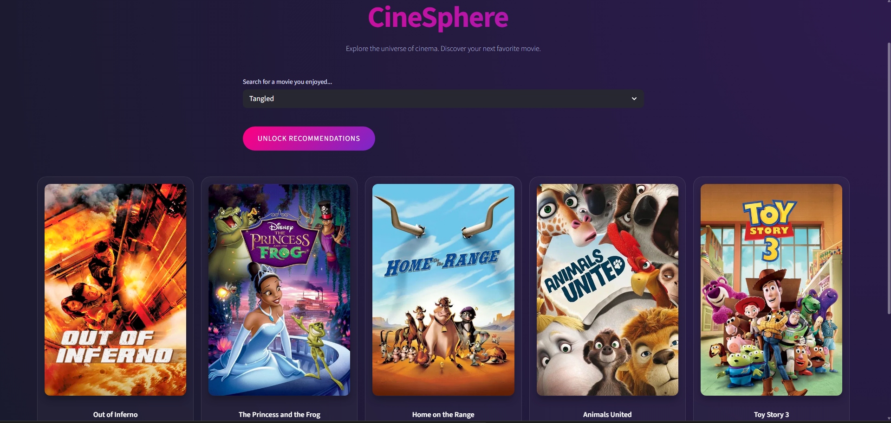

# 🎬 CineSphere | AI Movie Recommender


**CineSphere** is a premium, AI-powered movie recommendation engine that helps you discover your next favorite film. Using advanced Natural Language Processing (NLP) and machine learning, it analyzes movie tags, genres, and overviews to find hidden gems similar to the ones you already love.

---

## 📸 Screenshots

<div align="center">
  
  
</div>

---

## ✨ Features

- **🎯 Precision Recommendations**: Powered by Cosine Similarity and Count Vectorization on the TMDB 5000 dataset.
- **🎨 Premium UI/UX**: A modern, glassmorphic dark-themed interface built with Streamlit.
- **🖼️ Dynamic Posters**: Real-time movie poster fetching via the TMDB API.
- **⚡ Fast & Efficient**: Cached data loading for instant results.
- **📱 Responsive Design**: Optimized for a seamless experience across devices.

---

## 🛠️ Technology Stack

- **Frontend**: [Streamlit](https://streamlit.io/) (with custom CSS injection)
- **Data Science**: [Pandas](https://pandas.pydata.org/), [NumPy](https://numpy.org/)
- **Machine Learning**: [Scikit-Learn](https://scikit-learn.org/) (Cosine Similarity, CountVectorizer)
- **NLP**: [NLTK](https://www.nltk.org/) (Porter Stemmer)
- **API**: [TMDB API](https://www.themoviedb.org/documentation/api)

---

## 🚀 Getting Started

### 1. Prerequisites
Ensure you have Python 3.8+ installed.

### 2. Installation
Clone the repository and install the dependencies:

```bash
git clone https://github.com/Ashu4495/Movie-Recommender-System.git
cd Movie-Recommender-System
pip install -r requirements.txt
```

### 3. Generate Similarity Matrix
The project requires precomputed similarity files. Run the generation script:

```bash
python scripts/generate_similarity.py
```

### 4. Run the Application
Start the Streamlit server:

```bash
streamlit run app/main.py
```

---

## 🧠 How It Works

1. **Preprocessing**: The dataset is cleaned, and relevant features (genres, keywords, cast, crew) are combined into a single "tags" column.
2. **Vectorization**: Text data is converted into vectors using `CountVectorizer`, removing common stop words and applying stemming.
3. **Similarity Calculation**: We calculate the "distance" between movies in a 5000-dimensional space using **Cosine Similarity**.
4. **Recommendation**: When a movie is selected, the system finds the 5 closest vectors and displays them with their posters.

---

## 📝 License
Distributed under the MIT License. See `LICENSE` for more information.

---

<div align="center">
    <p>Created with ❤️ for Movie Lovers</p>
    <p>Powered by TMDB API & Scikit-Learn</p>
</div>
